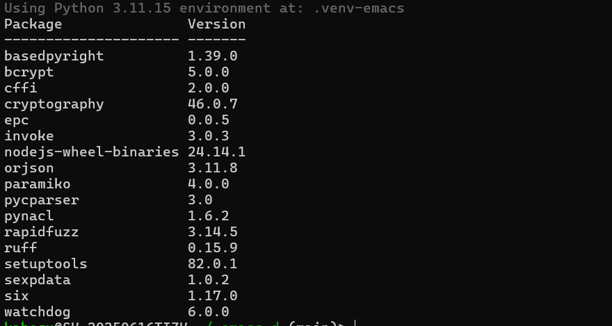
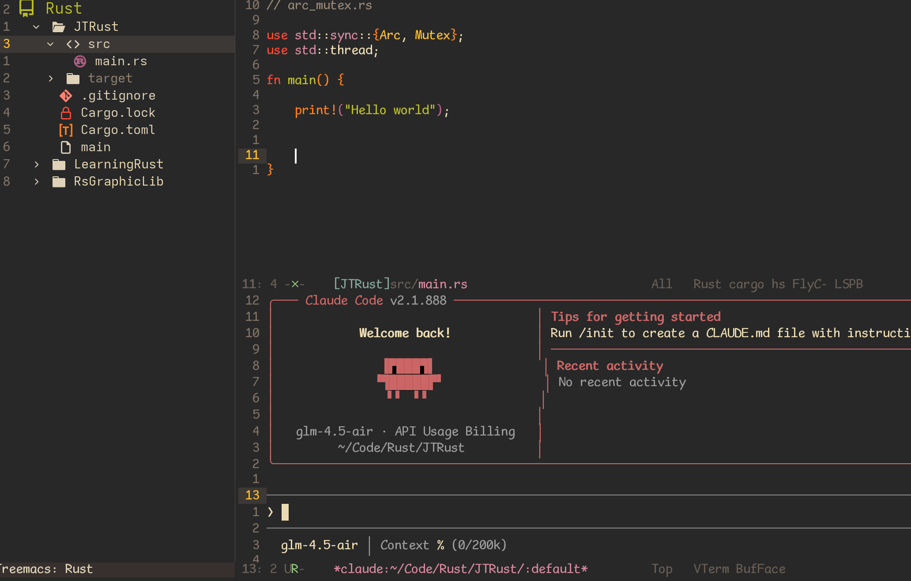

# 我的 Emacs 配置

Forked from [Pavinberg/emacs.d](https://github.com/Pavinberg/emacs.d)

一套为 Python/Rust/C++ 开发优化的 Emacs 配置。  

使用 `lsp-bridge` 提供极速流畅的代码补全体验，并集成了 `claude-code` AI 辅助编程。  

如果要使用`lsp-mode` 移步[lsp-mode](https://github.com/kabosusang/emacs.d/tree/main)


## 特性

- ⚡ **lsp-bridge**：异步 LSP 补全
- 🐍 **Python**：`basedpyright` + `ruff`，自动检测 `uv` 虚拟环境
- 🦀 **Rust**：`rust-analyzer` 
- 🔧 **C/C++**：`clangd` + `flycheck-clang-tidy`
- 🤖 **Claude Code**：AI 辅助编程集成
- 🎨 现代化界面：`ivy`/`counsel`、`dashboard`、`treemacs`
- ✨ 多光标编辑：`multiple-cursors` + `hydra`
- 📦 Git 集成：`magit` 

## 安装

### 克隆仓库
```bash
git clone --recursive https://github.com/kabosu/.emacs.d.git ~/.emacs.d
```
### 创建 Python 虚拟环境
LSP 服务器和 lsp-bridge 依赖需要安装在专用的虚拟环境中：  
```bash
# 创建虚拟环境
uv venv ~/.emacs.d/.venv-emacs --python 3.11

# 安装 LSP Python服务器
uv pip install --python ~/.emacs.d/.venv-emacs/bin/python basedpyright ruff

# 安装 lsp-bridge 依赖
uv pip install --python ~/.emacs.d/.venv-emacs/bin/python epc orjson rapidfuzz watchdog
```
### Python依赖如下


## 启动
首次启动`emacs`可能需要安装
```bash
M-x package-install vterm
```

## ScreenShot


